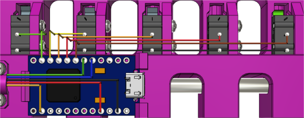

# SMuFF EStopMux

Firmware for the SMuFF Endstop Multiplexer when SMuFF is operating in advanced Splitter mode.

The EStop MUX comes in handy, as the SMuFF controller board doesn't have enough spare I/O pins to handle the states of 5 additional micro switches. The core of this MUX is an Arduino Pro Micro (Leonardo) development board, which has just the right size and amount of I/O pins for this task.
What is basically does, is to trace the states of the micro switches internally and output the state of the current tool to the output pin that's connected to the SMuFF controller.
Which the current tool is that needs to be multiplexd, the EStop MUX is being told by the SMuFF via a simple command on the TWI/I2C interface.

Compile this firmware and load it up to an Arduino Pro Micro board then wire it up as follows:

>**HINT:** There seems to be some unresolved issue in PlatformIO for the Leonardo chips. If you discover uploading issues in the form of:
**avrdude: ser_open(): can't open device "\\.\COMxx":**
after PlatformIO resets the board and waits for the new serial port, then the easiest work around I've found so far is copying the **main.cpp** file to **main.ino** and loading it into the Adruino IDE to compile and program it from there.

Black, Red and Orange wires (show at the bottom) are comming from the **Z-STOP** connector on the SMUFF controller (just as on the standard V6 version).
Blue and Green are SDA (IO **2**) & SCL (IO **3**) signals, coming from the 2nd TWI/I2C bus on the SMuFF controller. These can be located on the **STEP** (SCL2) and **ENABLE** (SDA2) pins of the Z-Axis stepper driver socket.

I/Os **4** to **10** on the Pro Micro are inputs and connected to the (middle) *N.O.* pin of each micro switch, whereas IO 4 goes to *T0*, IO 5 to *T1* and so on (shown as Brown, Red, Orange, Yellow, Green in the image above).
I/Os **9** and **10** are usually not connected, since the Splitter version is limited to 5 tools only.

I/O **16** is the output pin, **VCC** & **GND** are powering the Pro Micro.

For the sake of completeness, here's a detailed pinout of the Arduino Pro Micro (from Sparkfun):

